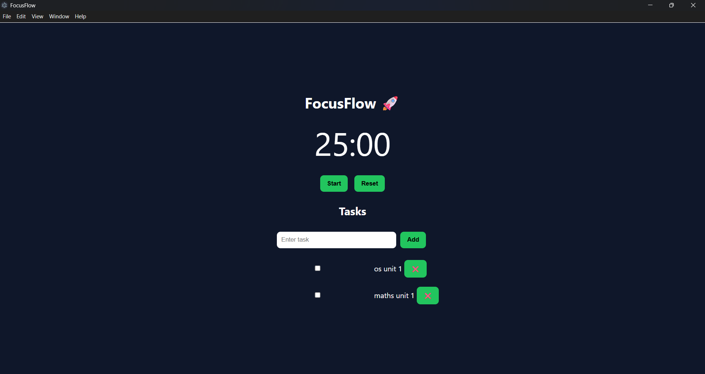

# 🚀 FocusFlow – Desktop Productivity App
FocusFlow is a modern desktop productivity application built using Electron.
It helps students stay focused, manage tasks, and improve productivity using the Pomodoro technique.
---

## ✨ Features
* ⏱️ **Pomodoro Timer** (25 min focus sessions)
* 📋 **Task Management System**
* 🔔 **Desktop Notifications**
* 💾 **Persistent Data Storage**
* 🎨 **Clean & Minimal UI**
* 💻 **Packaged Desktop App (.exe)**
---

## 🛠️ Tech Stack
* **Electron.js**
* **HTML, CSS, JavaScript**
* **Node.js**
---

## 📸 Preview


---

## 🚀 How to Run Locally
```bash
npm install
npm start
```

---

## 📦 Build Desktop App
```bash
npm run build
```

---
## 📂 Project Structure
```
focusflow/
│── main.js
│── index.html
│── style.css
│── script.js
│── package.json
```

---
## 💡 Future Improvements

* 📊 Analytics Dashboard
* 🔥 Daily Streak System
* ☁️ Cloud Sync
* 🎯 Goal Tracking

---
## 👩‍💻 Author
**Sharvari Dhole**

---

⭐ If you like this project, consider giving it a star!
